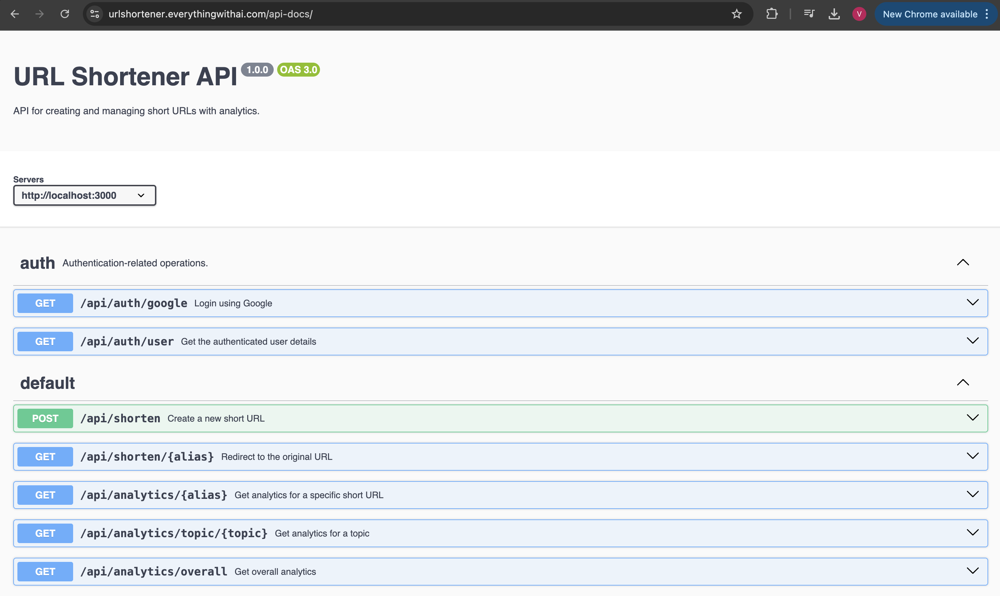

# URL Shortener API with Advanced Analytics

A scalable URL shortener service that provides advanced analytics, Google Sign-In authentication, and rate limiting capabilities. This API allows users to create and manage shortened URLs while tracking detailed usage analytics.

<div align="center">
  <h3>
    <a href="https://urlshortener.everythingwithai.com">
      View Live Demo
    </a>
    <span> | </span>
    <a href="https://urlshortener.everythingwithai.com/api-docs/">
      API Documentation
    </a>
  </h3>
  
</div>

## 🚀 Features

- **User Authentication**
  - Google Sign-In integration
  - Secure authentication flow
  - User-specific URL management

- **URL Management**
  - Create shortened URLs with optional custom aliases
  - Organize URLs by topics (acquisition, activation, retention)
  - Automatic URL validation and processing

- **Advanced Analytics**
  - Detailed click tracking and user engagement metrics
  - OS and device type analysis
  - Topic-based performance tracking
  - Time-series data for trend analysis

- **Performance & Security**
  - Redis caching implementation
  - Rate limiting to prevent abuse
  - Scalable database design
  - Docker containerization

## 🛠️ Tech Stack

- Node.js
- MongoDB (Database)
- Redis (Caching)
- Docker
- Google OAuth2.0
- Swagger (API Documentation)

## 📋 Prerequisites

- Node.js 16 or higher
- Docker and Docker Compose
- MongoDB
- Redis
- Google Cloud Console Account (for OAuth credentials)

## 🔧 Installation & Setup

1. Clone the repository:
   ```bash
   git clone https://github.com/vaibhxv/urlShortenerAssignment.git
   cd urlShortenerAssignment
   ```

2. Install dependencies:
   ```bash
   npm install
   ```

3. Configure environment variables:
   ```bash
   cp .env.example .env
   ```
   Update the `.env` file with your configuration:
   ```
   MONGODB_URI=your_mongodb_uri
   REDIS_URL=your_redis_url
   GOOGLE_CLIENT_ID=your_google_client_id
   GOOGLE_CLIENT_SECRET=your_google_client_secret
   JWT_SECRET=your_jwt_secret
   SESSION_SECRET=your_session_secret
   ```

4. Run with Docker:
   ```bash
   docker-compose up --build
   ```

## 🔌 API Endpoints

### Authentication
- `POST /api/auth/google` - Google Sign-In authentication

### URL Operations
- `POST /api/shorten` - Create short URL
- `GET /api/shorten/{alias}` - Redirect to original URL

### Analytics
- `GET /api/analytics/{alias}` - Get specific URL analytics
- `GET /api/analytics/topic/{topic}` - Get topic-based analytics
- `GET /api/analytics/overall` - Get overall analytics

## 💡 Implementation Details

### Caching Strategy
- Short URL mappings cached in Redis
- Analytics data cached with time-based expiration
- Cache invalidation on URL updates

### Rate Limiting
- Based on user IP and authentication status
- Configurable limits per endpoint
- Redis-based implementation

### Database Schema
- Optimized for quick lookups and analytics queries
- Proper indexing for frequently accessed fields
- Efficient storage of time-series data

## 🚀 Deployment

The application is deployed on AWS EC2 instance and made accessible through CloudFlare Tunnel at [https://urlshortener.everythingwithai.com](https://urlshortener.everythingwithai.com)

### Deployment Architecture
- AWS EC2 instance running Docker containers
- CloudFlare Tunnel for secure, encrypted connections
- Auto-scaling configuration for handling traffic spikes
- Continuous monitoring and logging setup

### Infrastructure Setup
1. EC2 instance provisioned with Docker and necessary dependencies
2. CloudFlare Tunnel configured for secure routing
3. MongoDB Atlas for database management
4. Redis Cloud for caching layer

## 🤝 Contributing

1. Fork the repository
2. Create your feature branch (`git checkout -b feature/AmazingFeature`)
3. Commit your changes (`git commit -m 'Add some AmazingFeature'`)
4. Push to the branch (`git push origin feature/AmazingFeature`)
5. Open a Pull Request

## 🎯 Challenges & Solutions

### Challenge 1: Scalable Analytics Processing
- **Problem**: Processing large volumes of analytics data in real-time
- **Solution**: Implemented batch processing with Redis queues and worker processes

### Challenge 2: Rate Limiting Implementation
- **Problem**: Implementing fair and efficient rate limiting across distributed systems
- **Solution**: Used Redis-based sliding window rate limiting with configurable windows

### Challenge 3: Caching Strategy
- **Problem**: Determining optimal caching strategy for different types of data
- **Solution**: Implemented tiered caching with different TTLs based on data type and access patterns

